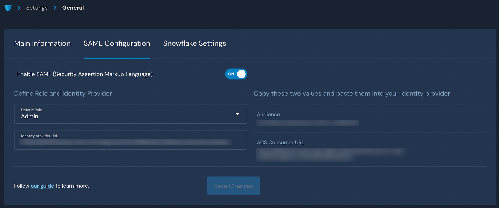

# OneLogin SSO

## Overview

Panther supports integrating with OneLogin as a SAML provider to enable logging in to the Panther Console via SSO.

For more information on features, terminology, and limitations of SSO integrations with the Panther Console, please see the Panther documentation: [SAML/SSO Integration](https://docs.panther.com/system-configuration/saml).

## How to configure SAML SSO to the Panther Console with OneLogin

### Obtain the OneLogin SSO parameters from Panther

1. Log in to the Panther Console.
2. In the left sidebar, click **Settings > General**.
3. Click the SAML Configuration tab.

Keep this browser window open, as you will need the **Audience** and **ACS URL** values in the next steps.

## Create the OneLogin App

1. Log in to the OneLogin administrative console.
2. Click the Applications tab, then click Applications in the drop-down menu.&#x20;
3. Click **Add App** in the upper right side of the page. Search for and select "SAML Test Connector (Advanced)."\
    (5) (7) (8) (1) (1) (3) (1) (1) (1) (2) (4) (9).png>)
4. Fill in the form:\
   Note: We recommend that you disable the "visible in portal" option since SAML logins can only be initiated from Panther.
   * **Display Name**: Add a descriptive name, such as "Panther Console."
   * **Logo Icon**: Upload a Panther logo to help users quickly identify this app.
   * **Description**: Add a description of the app.
5. Click **Save**.
6. Open your new app's "Configuration" page. Under "Application Details," enter the following:
   * **Audience**: Enter the **Audience** you copied from the Panther Console in earlier steps of this documentation.
   * **ACS (Consumer) URL Validator**: Enter the **ACS URL** you copied from the Panther Console in earlier steps of this documentation.
   * **ACS (Consumer) URL**: Enter the **ACS URL** you copied from the Panther Console in earlier steps of this documentation.
7. In the Parameters tab, add the attribute mappings for Panther. Check the box next to "Include in SAML assertion" for each attribute.
   * `PantherFirstName`: `First Name`
   * `PantherLastName`: `Last Name`
   * `PantherEmail`: `Email`\
     ``When you are done, they will appear in the attributes list: \
     `` (8) (9) (5) (1) (1) (2) (1) (1) (1) (10) (12) (12).png>)``
8. Click **Save**.
9. In the SSO tab, set the algorithm to SHA-512.&#x20;
10. Copy the **Issuer URL** and store it in a secure location. You will need this in the next steps.\
     (8) (9) (6) (1) (1) (2) (1) (1) (1) (10) (12) (12).png>)
11. Save your settings.

After you're done, make sure to grant access to the appropriate users and groups.

### Configure OneLogin SAML in Panther

1. Navigate back to the [SAML configuration](onelogin.md#obtain-the-onelogin-sso-parameters-from-panther) you started earlier in this documentation.
2. Next to "Enable SAML", set the toggle to **ON**.&#x20;
3. In the "Default Role" field, choose the Panther role that your new users will be assigned by default when they first log in via SSO.
4. In the **Identity Provider URL** field, paste the **Issuer URL** from OneLogin that you obtained in the previous steps of this documentation.
5. Click **Save Changes**.

To test your setup, go to your Panther sign-in page and click **Login with SSO**.

 (1) (1) (1) (11) (1) (1) (1) (10) (12) (22).png>)
