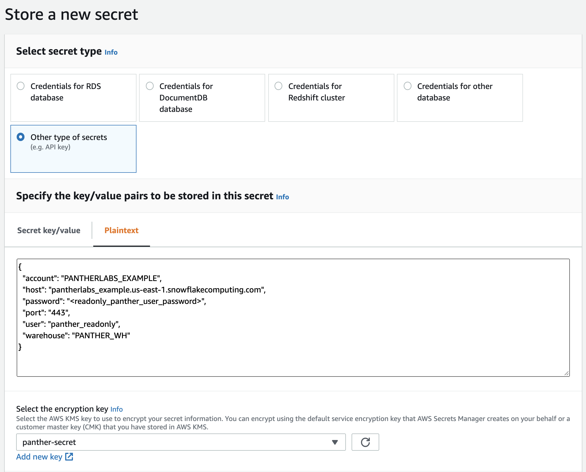
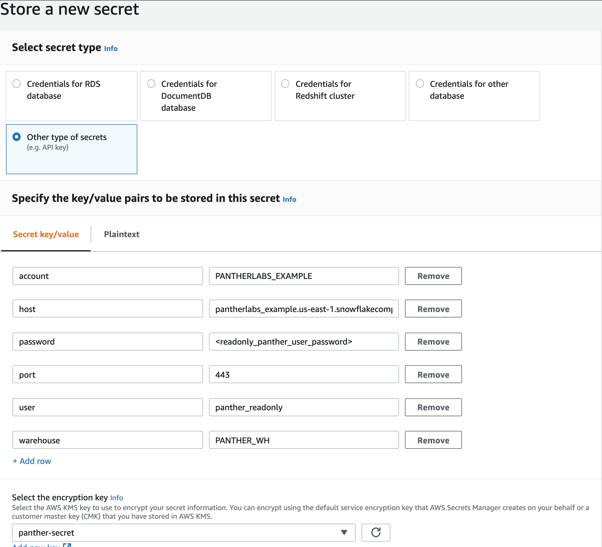

# Snowflake Integration

Panther can be configured to write processed log data to an AWS-based [Snowflake](https://www.snowflake.com) database cluster. This allows you to join Panther processed data with your other data sources in Snowflake.

Integrating Panther with Snowflake enables Panther data to be used in your Business Intelligence tools to make dashboards tailored to you operations. In addition, you can join Panther data \(e.g., Panther alerts\) to your business data, enabling assessment of your security posture with respect to your organization.

For example, you can tally alerts by organizational division \(e.g., Human Resources\) or by infrastructure \(e.g., Development, Test, Production\).

Panther uses [Snowpipe](https://docs.snowflake.com/en/user-guide/data-load-snowpipe-intro.html) to copy the data into your Snowflake cluster.

## Configuration Overview

This guide assumes you already have a Snowflake instance in AWS.

Ideally, your Panther deployment and Snowflake instance are in the same AWS region. Having both Panther and Snowflake in the same region lowers latency for queries and data movement \(relative to cross region communications\).

Panther uses two Snowflake users/roles to access your Snowflake instance:

1. A read only user/role for queries
2. An admin user/role with strict permissions only to the Panther databases to create tables when new log sources are onboarded into Panther.

There are 9 steps to configuring Panther integration with Snowflake.

1. Security Team: Gather configuration information from Panther
2. DBA: Gather configuration information from Snowflake
3. DBA: Create the Panther databases in Snowflake
4. DBA: Create a read only role and an administrative role in Snowflake \(limited to Panther tables\)
5. DBA: Create a read only user and an administrative user in Snowflake
6. DBA: Create a stored procedure to make creating AWS Secrets easier \(optional\)
7. AWS Admin: Create a KMS key in your AWS account for Panther Snowflake Secrets
8. AWS Admin: Create a read only user AWS Secret and an administrative user AWS Secret
9. Panther \(SaaS\) or Customer \(CloudPrem\): Deploy Panther with Snowflake enabled

## 1. Gather configuration information from Panther

Go to the `Settings` page of Panther and select `General Settings`. There you will find:

* Snowflake ReadOnly Lambda Role ARN
* Snowflake Admin Lambda Role ARN


Keep these ARNs handy, we will use this later.

## 2. Gather configuration information from Snowflake

In order to configure Panther, you need to get the `SNOWFLAKE_IAM_USER` from Snowflake.

In a Snowflake SQL shell execute the below sql, replacing `myaccountid` with your AWS account ID and `myaccountregion` with the account's region:

```sql
SELECT system$get_aws_sns_iam_policy('arn:aws:sns:myaccountregion:myaccountid:panther-processed-data-notifications');
```

You should see a response similar to:

```javascript
{
 "Version":"2012-10-17",
 "Statement":[
  {
    "Sid":"1",
    "Effect":"Allow",
    "Principal":{
       "AWS":"arn:aws:iam::87654321XXXX:user/k7m2-s-v2st0722"
    },
    "Action":["sns:Subscribe"],
    "Resource":["arn:aws:sns:us-west-1:12345678XXXX:panther-processed-data-notifications"]
  }
 ]
}
```

In the above example, the `SNOWFLAKE_IAM_USER` is the `AWS` attribute `arn:aws:iam::87654321XXXX:user/k7m2-s-v2st0722`. Keep this handy, we will use this in a later step.

## 3. Create the Panther databases in Snowflake

Execute in Snowflake SQL shell:

```sql
USE ROLE SYSADMIN;

---------------- databases
CREATE database IF NOT EXISTS panther_logs;
CREATE database IF NOT EXISTS panther_rule_matches;
CREATE database IF NOT EXISTS panther_rule_errors;
CREATE database IF NOT EXISTS panther_cloudsecurity;
CREATE database IF NOT EXISTS panther_monitor;
CREATE database IF NOT EXISTS panther_views;
CREATE database IF NOT EXISTS panther_stored_procedures;
```

## 4. Create a read only role and an administrative role in Snowflake

_**NOTE**_: be sure to update `<your warehouse>` in the first line of the SQL block below to the desired Snowflake warehouse name that you wish Panther to use.

We recommend you create a dedicated Panther warehouse \(e.g., PANTHER\_WH\), so that you can easily track costs and resize capacity independently of other Snowflake resources.

Execute in Snowflake SQL shell:

```sql
SET WAREHOUSE_NAME = '<your_warehouse>';
USE ROLE SECURITYADMIN;

--------------- create panther_readonly_role
CREATE ROLE IF NOT EXISTS panther_readonly_role;

---------------- grants for panther_readonly_role

-- warehouse
GRANT USAGE
  ON WAREHOUSE IDENTIFIER($WAREHOUSE_NAME)
  TO ROLE panther_readonly_role;

-- panther_logs
GRANT USAGE
  ON DATABASE panther_logs
  TO ROLE panther_readonly_role;
GRANT USAGE
  ON SCHEMA panther_logs.public
  TO ROLE panther_readonly_role;
GRANT SELECT
  ON ALL TABLES IN SCHEMA panther_logs.public
  TO ROLE panther_readonly_role;
GRANT SELECT
  ON ALL VIEWS IN SCHEMA panther_logs.public
  TO ROLE panther_readonly_role;
GRANT SELECT
  ON FUTURE TABLES IN SCHEMA panther_logs.public
  TO ROLE panther_readonly_role;
GRANT SELECT
  ON FUTURE VIEWS IN SCHEMA panther_logs.public
  TO ROLE panther_readonly_role;

-- panther_rule_matches
GRANT USAGE
  ON DATABASE panther_rule_matches
  TO ROLE panther_readonly_role;
GRANT USAGE
  ON SCHEMA panther_rule_matches.public
  TO ROLE panther_readonly_role;
GRANT SELECT
  ON ALL TABLES IN SCHEMA panther_rule_matches.public
  TO ROLE panther_readonly_role;
GRANT SELECT
  ON ALL VIEWS IN SCHEMA panther_rule_matches.public
  TO ROLE panther_readonly_role;
GRANT SELECT
  ON FUTURE TABLES IN SCHEMA panther_rule_matches.public
  TO ROLE panther_readonly_role;
GRANT SELECT
  ON FUTURE VIEWS IN SCHEMA panther_rule_matches.public
  TO ROLE panther_readonly_role;

-- panther_rule_errors
GRANT USAGE
  ON DATABASE panther_rule_errors
  TO ROLE panther_readonly_role;
GRANT USAGE
  ON SCHEMA panther_rule_errors.public
  TO ROLE panther_readonly_role;
GRANT SELECT
  ON ALL TABLES IN SCHEMA panther_rule_errors.public
  TO ROLE panther_readonly_role;
GRANT SELECT
  ON ALL VIEWS IN SCHEMA panther_rule_errors.public
  TO ROLE panther_readonly_role;
GRANT SELECT
  ON FUTURE TABLES IN SCHEMA panther_rule_errors.public
  TO ROLE panther_readonly_role;
GRANT SELECT
  ON FUTURE VIEWS IN SCHEMA panther_rule_errors.public
  TO ROLE panther_readonly_role;

-- panther_cloudsecurity
GRANT USAGE
  ON DATABASE panther_cloudsecurity
  TO ROLE panther_readonly_role;
GRANT USAGE
  ON SCHEMA panther_cloudsecurity.public
  TO ROLE panther_readonly_role;
GRANT SELECT
  ON ALL TABLES IN SCHEMA panther_cloudsecurity.public
  TO ROLE panther_readonly_role;
GRANT SELECT
  ON ALL VIEWS IN SCHEMA panther_cloudsecurity.public
  TO ROLE panther_readonly_role;
GRANT SELECT
  ON FUTURE TABLES IN SCHEMA panther_cloudsecurity.public
  TO ROLE panther_readonly_role;
GRANT SELECT
  ON FUTURE VIEWS IN SCHEMA panther_cloudsecurity.public
  TO ROLE panther_readonly_role;

--panther_monitor
GRANT USAGE
  ON DATABASE PANTHER_MONITOR 
  TO ROLE PANTHER_READONLY_ROLE;  
GRANT USAGE 
  ON SCHEMA PANTHER_MONITOR.PUBLIC 
  TO ROLE PANTHER_READONLY_ROLE;  
GRANT SELECT 
  ON ALL TABLES  IN SCHEMA PANTHER_MONITOR.PUBLIC 
  TO ROLE panther_readonly_role;
GRANT SELECT 
  ON ALL VIEWS   IN SCHEMA PANTHER_MONITOR.PUBLIC 
  TO ROLE panther_readonly_role;
GRANT SELECT 
  ON FUTURE TABLES  IN SCHEMA PANTHER_MONITOR.PUBLIC 
  TO ROLE panther_readonly_role;
GRANT SELECT 
  ON FUTURE VIEWS   IN SCHEMA PANTHER_MONITOR.PUBLIC 
  TO ROLE panther_readonly_role;

-- panther_views
GRANT USAGE
  ON DATABASE panther_views
  TO ROLE panther_readonly_role;
GRANT USAGE
  ON SCHEMA panther_views.public
  TO ROLE panther_readonly_role;
GRANT SELECT
  ON ALL TABLES IN SCHEMA panther_views.public
  TO ROLE panther_readonly_role;
GRANT SELECT
  ON ALL VIEWS IN SCHEMA panther_views.public
  TO ROLE panther_readonly_role;
GRANT SELECT
  ON FUTURE TABLES IN SCHEMA panther_views.public
  TO ROLE panther_readonly_role;
GRANT SELECT
  ON FUTURE VIEWS IN SCHEMA panther_views.public
  TO ROLE panther_readonly_role;

--------------- create panther_admin_role
CREATE ROLE IF NOT EXISTS panther_admin_role;

GRANT ROLE panther_readonly_role
    TO ROLE panther_admin_role;

---------------- grants for panther_admin_role

-- panther_logs
GRANT CREATE TABLE, CREATE VIEW, CREATE STAGE, CREATE PIPE, MODIFY
  ON ALL SCHEMAS IN DATABASE panther_logs
  TO ROLE panther_admin_role;

-- panther_rule_matches
GRANT CREATE TABLE, CREATE VIEW, CREATE STAGE, CREATE PIPE, MODIFY
  ON ALL SCHEMAS IN DATABASE panther_rule_matches
  TO ROLE panther_admin_role;

-- panther_rule_errors
GRANT CREATE TABLE, CREATE VIEW, CREATE STAGE, CREATE PIPE, MODIFY
  ON ALL SCHEMAS IN DATABASE panther_rule_errors
  TO ROLE panther_admin_role;

-- panther_cloudsecurity
GRANT CREATE TABLE, CREATE VIEW, CREATE STAGE, CREATE PIPE, MODIFY
  ON ALL SCHEMAS IN DATABASE panther_cloudsecurity
  TO ROLE panther_admin_role;

-- panther_monitor
GRANT CREATE TABLE, CREATE VIEW, MODIFY 
  ON ALL SCHEMAS IN DATABASE PANTHER_MONITOR 
  TO ROLE panther_admin_role;
GRANT SELECT, INSERT, UPDATE 
  ON ALL TABLES IN SCHEMA PANTHER_MONITOR.PUBLIC 
  TO ROLE PANTHER_ADMIN_ROLE;
GRANT SELECT, INSERT, UPDATE 
  ON FUTURE TABLES IN SCHEMA PANTHER_MONITOR.PUBLIC 
  TO ROLE PANTHER_ADMIN_ROLE;

-- panther_views
GRANT CREATE VIEW, MODIFY
  ON ALL SCHEMAS IN DATABASE panther_views
  TO ROLE panther_admin_role;

-- panther_stored_procedures
GRANT USAGE ON DATABASE panther_stored_procedures
TO ROLE panther_admin_role;

GRANT CREATE PROCEDURE, CREATE FUNCTION, MODIFY, USAGE
ON ALL SCHEMAS IN DATABASE panther_stored_procedures
TO ROLE panther_admin_role;

-- this allows panther_admin_role to create a storage integration for Panther's s3 bucket
-- NOTE: this grant can be removed after Panther is initially successfully onboarded
USE ROLE ACCOUNTADMIN;

GRANT CREATE INTEGRATION ON ACCOUNT TO ROLE panther_admin_role;

-- allow access to snowflake's audit database for panther (optional)
GRANT IMPORTED PRIVILEGES ON DATABASE snowflake TO ROLE panther_readonly_role;
```

## 5. Create a read only user and an administrative user in Snowflake

NOTE: set `<your_readonly_password>` and `<your_admin_password>` below. Execute in Snowflake SQL shell:

```sql
USE ROLE SECURITYADMIN;

-- panther_readonly user
CREATE USER IF NOT EXISTS panther_readonly password='<your_readonly_password>';

GRANT ROLE panther_readonly_role
   TO USER panther_readonly;

ALTER USER panther_readonly
   SET default_role = panther_readonly_role;

-- panther_admin user
CREATE USER IF NOT EXISTS panther_admin password='<your_admin_password>';

GRANT ROLE panther_admin_role
   TO USER panther_admin;

ALTER USER panther_admin
   SET default_role = panther_admin_role;

ALTER USER PANTHER_ADMIN 
   SET TIMEZONE = 'UTC';
```

## 6. Create a stored procedure to make creating AWS Secrets easier \(Optional\)

Define this stored procedure that will create a JSON document you can use to cut-n-paste into AWS Secret Manger \(saving typing\). Execute in Snowflake SQL shell:

```sql
USE ROLE SYSADMIN;

CREATE or replace FUNCTION panther_stored_procedures.public.generate_secret(USN VARCHAR, PWD VARCHAR, WHS VARCHAR, HST VARCHAR)
  RETURNS OBJECT
    LANGUAGE SQL
    STRICT
    AS
  $$
  SELECT object_construct('account', current_account(),
                        'user', USN ,
                        'password', PWD ,
                        'host',TRIM(REPLACE(HST,'https://'),'/'),
                        'port','443',
                        'warehouse',WHS) AS SECRET
  $$;
  -- Customize the values here to match your password, a compute warehouse you will be using, and your hostname.
  -- The hostname is usually "<something>.snowflakecomputing.com" from the URL used to log into your cluster.
  -- SELECT panther_stored_procedures.public.generate_secret('panther_readonly','password123','COMPUTE_WH','<something>.snowflakecomputing.com');
```

## 7. Create a KMS key in your AWS account for Panther Snowflake Secrets

You will use this key to encrypt the Snowflake secrets that we will store in your AWS account as part of Step 8.

* Log in to your AWS account
* \(Optional\) Go to the same region that your Snowflake account is in
* Go to KMS service
* Click on `Create a key`
* Pick `Symmetric` for the type and click `Next`
* Set the alias to `panther-secret`. Click `Next`. On the next page Click `Next` \(accept defaults\)
* Click on `Add another AWS Account` and enter the account id where Panther is installed.
* Click `Next` and then click `Finish`.

## 8. Create a read only user AWS Secret and an administrative user AWS Secret

You will use [AWS Secrets Manager](https://aws.amazon.com/secrets-manager/) to store the Snowflake user password. It will be configured to only allow access from a single lambda function in the Panther account.

Repeat the process below, once for `panther_readonly` user and once for the `panther_admin` user.

* Access the AWS Secrets Manager via the console and select `Store a New Secret` button on the page.
* You will be presented with a page titled `Store a new secret`. Select `Other type of secrets` from the list of types. Specify the following key/value pairs:

| Field | Description |
| :---: | :--- |
| `account` | The name of your Snowflake account. It can be found by executing `SELECT CURRENT_ACCOUNT()` |
| `user` | Snowflake user you created earlier, either `panther_readonly` or `panther_admin` |
| `password` | The Snowflake user password that you created in Step 1 |
| `host` | This is usually `<something>.snowflakecomputing.com` from the URL used to log into your cluster. Remove `https://` and any trailing `/` from the hostname. |
| `port` | Use `443` unless you have configured differently |
| `warehouse` | The name of your Snowflake active warehouse |

You can enter the above by hand OR run the following command in a Snowflake SQL shell, typing in the appropriate values for the 4 specified parameters \(`account` and `port` should autopopulate\). Do this once for the `panther_readonly` user and once for the `panther_admin`:

```sql
SELECT panther_stored_procedures.public.generate_secret(<user>,<password>,<warehouse>,<host>);
```

You can then copy-paste the result into each of the 2 secrets "plaintext" editor tab.



_**NOTE**_: Check to make sure that all 6 fields \(_account, host, password, port, user, warehouse_\) are filled out and have the correct values, otherwise the Panther lambdas may encounter issues connecting to snowflake.

* Select `panther-secret` from the dropdown under `Select the encryption key`.
* Click `Next`.



* You will be presented with a screen asking for the name and description of the secret. Fill these in and click `Next`.


* The next screen concerns autorotation, just click the `Next` button.


* Finally, you will be presented with an overview screen. Scroll to the bottom and click the `Store` button.

### Update Permissions for the Secrets

We need to configure the permissions for the two Panther AWS secrets such that only the specific Panther lambdas have access to the Snowflake secret.

The Panther `panther-snowflake-api` will use the `panther_readonly` user for user queries while the `panther-snowflake-admin-api` will use the `panther_admin` user to create tables when new log sources are onboarded.

Go to the console and select each of the secrets you created above. On the overview screen click on the `Edit Permissions` button. Copy the below policy JSON, substituting the appropriate `<lambda role>`, either:

* `panther-snowflake-api` role collected in the first step
* `panther-snowflake-admin-api` role collected in the first step

For the value of `<secret ARN>` use the ARN of the secret you are updating.

```javascript
{
    "Version": "2012-10-17",
    "Statement": [
        {
            "Effect": "Allow",
            "Principal": {"AWS": "<lambda role>" },
            "Action": "secretsmanager:GetSecretValue",
            "Resource": "<secret ARN>"
        }
    ]
}
```

Then click the `Save` button.

Make a note of the `arn` for the secret. We will use this later.

## 9. Deploy Panther with Snowflake enabled

### SaaS Users

Send to your Panther point of contact \(POC\):

* `SNOWFLAKE_IAM_USER` collected in the first step
* ARN for the `panther_readonly` user AWS Secret
* ARN for the `panther_admin` user AWS Secret

Your Panther POC will re-deploy Panther with these settings to enable Snowflake.

### CloudPrem Users

Customers running Panther in their own accounts \(we call that `CloudPrem)` need to first deploy the master template doing an initial setup of Panther. After deploying the master template configure the master stack parameters as below:

* update: `SnowflakeAPISecretARN` parameter as the ARN of the secret created above for the `panther_readonly` user.
* update: `SnowflakeAdminAPISecretARN` parameter as the ARN of the secret created above for the `panther_admin` user.
* update: `SnowflakeDestinationClusterARNs` parameter as the value of `<SNOWFLAKE_IAM_USER>` from initial step above.

Execute an update to the Cloudformation stack.

## Validation of Snowpipe Processing

Once Panther is configured for Snowflake, you should have seven databases:

* `panther_logs`
* `panther_rule_matches`
* `panther_rule_errors`
* `panther_cloudsecurity`
* `panther_views`
* `pather_stored_procedures`
* `panther_monitor`

These are the same database names used in AWS Athena and queries should behave similarly.

Assuming you have data being regularly being processed, there should be data in the tables in a few minutes. This depends on your rate of log ingestion.

You can quickly test if the data ingestion is working by running a simple query:

```sql
SELECT count(1) AS c FROM panther_views.public.all_logs ;
```

The configuration can be tested from the [Data Explorer](../data-analytics/data-explorer.md). Run some same queries over a table that you know has data \(check via Snowflake console\).

## Rotating Secrets

To rotate secrets, create a NEW user and edit the secret replacing the old user and password with the new user and password. Wait one hour before deleting/disabling the old user in Snowflake.

## Source Deployments \(Panther internal users only\)

Edit your `deployments/panther_config.yml`.

Update `SecretsManagerARN` in the `panther_config.yml` file using the `arn`s of your created secrets.

```yaml
# Setting this configures SnowflakeAPI allowing the Data Explorer and scheduled queries to
    # access data in Snowflake. This is the ARN of a secret in AWS Secrets Manager with the following attributes:
    #  * account
    #  * user
    #  * password
    #  * host
    #  * port
    # For example:
    # SecretsManagerARN: arn:aws:secretsmanager:us-east-2:05060362XXXX:secret:panther-snowflake-readonly-secret-x1CT28
    SecretsManagerARN: arn:aws:secretsmanager:eu-central-1:18532453XXXX:secret:panther-snowflake-readonly-secret-Uk9bBw
    # Similar to the above, this secret is used by the deployment and source onboarding operations to create/update tables
    SecretsManagerAdminARN: arn:aws:secretsmanager:eu-central-1:18532453XXXX:secret:panther-snowflake-admin-secret-aaa9bBw
```

Add `<SNOWFLAKE_IAM_USER>` \(e.g., `arn:aws:iam::34318291XXXX:user/k7m2-s-v2st0722`\) to the Snowflake configuration:

```yaml
 # Snowflake (https://www.snowflake.com/) Integration
  Snowflake:
    # List of Snowflake cluster IAM ARNs which will ingest the output of Panther log processing.
    # To configure Snowflake, after deployment generate a file with the ops tool `snowpipe`.
    # This file should be run in your snowflake cluster to configure Snowpipe and declare the Panther tables.
    # For example:
    # DestinationClusterARNs:
    #  - arn:aws:iam::34318291XXXX:user/k8m1-s-v2st0721 # test snowflake cluster
    #  - arn:aws:iam::34318291XXXX:user/h1h4-s-a2st0111 # production snowflake cluster
    DestinationClusterARNs:
      - arn:aws:iam::34318291XXXX:user/k7m2-s-v2st0722
```

Run `mage deploy`.

