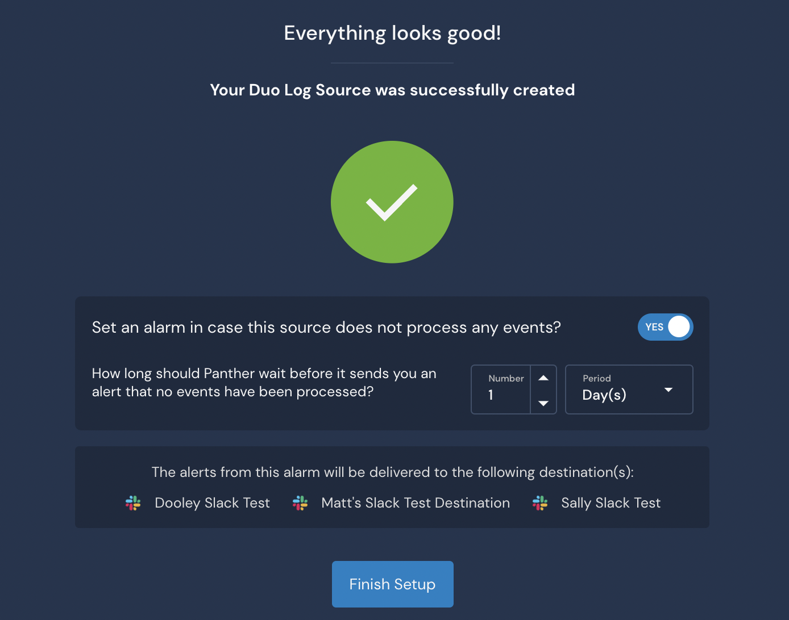

# Configuring System Health Notification Alarms

## Log Source Health Notifications

Panther performs health checks on log sources to ensure that Panther is correctly linked to the source, has the right credentials, and is receiving data from the source consistently. When those health checks fail for a given log source, Panther will send a "System Error" alert to the **Alerts** page in Panther and to any configured alert destinations.

To ensure that you receive alerts for System Health errors:

* Configure an alert destination that is receiving the "System Error" alert type.
* Configure alarms for log sources that will trigger an alert when data is no longer being received.

For instructions on configuring destinations and alarms for system health errors, please see the sections below.

### Configuring Delivery of System Health Error Alerts

By default, Panther will send these alerts to the **Alerts** page in your Panther Console. To ensure these alerts are sent to a custom alert destination, follow the steps below:

1. Log in to your Panther Console.
2. On the left sidebar navigation, click **Integrations** > **Alert Destinations**
3. Choose an existing Alert Destination or add a new Alert Destination.
4. On the configuration page for the Alert Destination, add "System Errors" to the **Alert Types** section:

.png>)

### Configuring Alarms for Log Drop-offs for your Log Sources

Panther allows you to set up alarms for individual log sources, which will trigger an alert if data is not received over a specific time interval. This can be useful for log sources that have been incorrectly linked to Panther or are experiencing issues outside of Panther.&#x20;

You can add an alarm to a new or an existing log source.

#### Setting Up an Alarm for an Existing Log Source

1. &#x20;Log in to your Panther Console.
2. On the left sidebar navigation, click **Integrations** > **Log Sources**.
3. Select the log source to configure an alarm for.
   1. Click the three dots icon on the right side of the log source tile: \
      
   2. Select "Alarm Configuration" from the dropdown menu.
4. Next to _Set an alarm in case this source does not process any events for 24 hours?_, toggle the setting to **YES** to enable alarms.&#x20;
   * On this page, you can also view which destinations will receive the alerts from this alarm.

.png>)

#### Setting up Alarms for New Log Sources

You can also add an alarm when onboarding a new log source:

1. Log in to your Panther Console.
2. On the left sidebar navigation, click **Integrations > Log Sources**
3. Click **+** in the upper right side of the page to add a new log source.
4. Complete each step of the onboarding workflow.
5. On the success page at the end of the onboarding workflow, next to _Set an alarm in case this source does not process any events for 24 hours?_, toggle the setting to **YES** to enable alarms.
   * On this page, you can also view which destinations will receive the alerts from this alarm.
6. Click **Finish Setup**.

Once you have alarms configured and alert destinations updated, you will receive health notifications if conditions are met to trigger them.
