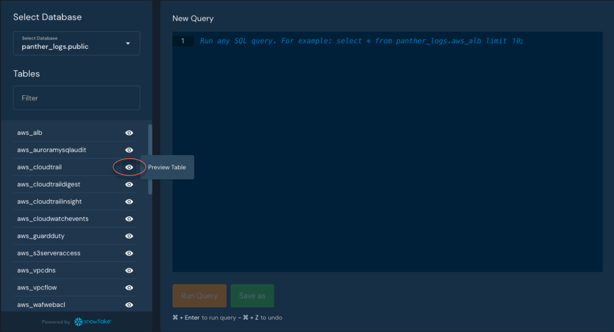

# Writing Detections

## Overview

Panther has three core Detection types to trigger alerts on suspicious behavior:

* **Rules**
  * Panther's Rules are Python functions for detecting suspicious log activity and generating alerts. Rules specifically apply to security logs. For more information, see [Rules](rules.md).
* **Scheduled Rules**&#x20;
  * Panther's Scheduled Rules are Python functions that run on query results against your data lake. For more information, see [Scheduled Rules](../data-analytics/scheduled-queries.md#create-a-scheduled-rule).
* **Policies**&#x20;
  * Panther's Policies are Python functions that scan and evaluate cloud infrastructure configurations to identify misconfigured infrastructure and subsequently generate alerts. Policies specifically apply to cloud resources. For more information, see [Policies](policies.md).

### Supported Workflows

Panther detections are created and managed using one of the following methods:

* **In the Panther Console.**
  * These can be supplemented with Panther-managed detections from [Detection Packs](detection-packs.md).
* **Using the** [**Panther Analysis Tool (PAT)**](panther-analysis-tool.md).&#x20;
  * Learn more about managing Panther detections using a Continuous Integration and Continuous Deployment workflow in our [CI/CD Guide](../guides/ci-cd-onboarding-guide.md).


**Note**: Managing Detections via the Panther Console is not recommended if you are already using a Git-Based workflow to manage and upload detections with Panther Analysis Tool. Managing detections via both methods simultaneously may result in unexpected behavior.


### Working with your data in Panther

#### Schema definitions

Panther’s Schemas provide helpful information on the types of _fields_ contained within your data, which makes it easier to understand how to interact with your data when writing a Detection.&#x20;

Schema definitions can be found in:

* Panther's documentation
  * See schemas for each integration within the [Supported Logs](../data-onboarding/supported-logs/) section of the documentation, and find more information about Custom Log schemas in [Custom Logs](../data-onboarding/custom-log-types/).
* The Panther Console
  * Log in to the Panther Console and navigate to **Data > Schemas**.

#### Pulling samples out of Data Explorer

Data Explorer makes it easier to understand and investigate data, location of data, and data types when writing Python code.  It contains all the data Panther parses from your log sources and stores the data in tables.

Explore and find log events by searching the relevant table for the log type you are interested in writing a detection for.

You can [preview example table data](https://docs.panther.com/data-analytics/data-explorer#preview-table-data) without writing SQL. To generate a sample SQL query for that log source, click the eye icon next to the table type:



When the query has produced results, you will see the example log events in the Results table. You can download these as a CSV file.&#x20;

To copy the log event to be used in [Unit Tests](https://docs.panther.com/writing-detections/testing) while writing detections, click **View JSON**.

## How to write detections

### Writing detections in the Panther Console

1. Click **Detections > All Detections**.
2. Click **Create New**.
3. Select your detection type between a **Rule, Policy,** or **Scheduled Rule.**
4. Fill out the required Basic Info as follows:
   * **Enabled:** Toggle the button in the right-hand corner to "On."
   * **Name**: **** Enter a memorable name for your new detection.
   * **Severity**: **** Select a [detection severity](triaging-alerts.md#alert-severities) from the drop-down options.
   * The lower right-hand drop-down menu differs depending on the detection type you chose:
     * **Rule:** Select the applicable Log Types.
     * **Policy:** Select the applicable Resource Types.
     * **Scheduled Rule:** Select the [Scheduled Query](../data-analytics/scheduled-queries.md) or queries this rule should apply to.
   * **Unique ID** (optional)**:** Click the **pen icon** and enter a unique ID for your detection**.**&#x20;
5. Click the **Functions & Tests tab** and **write** a Python function to define your Detection in the Rule Function text editor.
   * For detection templates and examples, see the [panther\_analysis repo on Github](https://github.com/panther-labs/panther-analysis/tree/master/templates).
6. Click **{} Create Test** to run a test against the Detection you defined in the previous step.
7. Optional: Adjust your **Rule Settings** or add a report on **Report Mapping**.
8. Click **Save** in the upper right corner.
9. You will land on your detection's information page - click **Edit** in the upper right-hand corner to manage or update your detection.

### Writing detections with Panther Developer Workflows

Panther Developer Workflows are workflows that can be used outside of the Panther Console to interact with your Panther account, such as the Panther API, Panther Analysis Tool (PAT), Panther Log Tool, and CI/CD workflows.&#x20;

Specifically, PAT can test and upload locally managed Detections and optionally integrate with a CI/CD setup. For more information, see [Panther Developer Workflows](panther-analysis-tool.md).

At a high level, this is how you write detections using PAT:

1. Using [Panther Analysis](https://github.com/panther-labs/panther-analysis), [**clone** the `panther-analysis` repository](https://github.com/panther-labs/panther-analysis#clone-the-repository).
2. ****[**Configure** your Python environment](https://github.com/panther-labs/panther-analysis#configure-your-python-environment).
3. ****[**Write** detections-as-code](https://github.com/panther-labs/panther-analysis#writing-detections) using Panther's [templates](https://github.com/panther-labs/panther-analysis/tree/master/templates).
4. For further testing, packaging, and deploying capabilities, **install our Python CLI** called **** the [Panther Analysis Tool](https://github.com/panther-labs/panther\_analysis\_tool#panther-analysis-tool).

## Panther Detection examples and best practices

### Python best practices

Python Enhancement Proposals [publishes resources](https://peps.python.org/pep-0008/) on how to cleanly and effectively write and style your Python code. For example, you can use [autopep8](https://pypi.org/project/autopep8/) to automatically ensure that the Detections you write all follow a consistent style.

### **Understanding the structure of a Detection in Panther**

See the [Detection Functions](./#detection-functions) section below to view all available functions within a Panther Detection.

The only required function is `def rule(event)`, but other functions make your Alerts more dynamic. See the[ ](https://www.notion.so/Detections-Style-Guide-46f53365be2041d39141092804588cd0)section [Configuring Detection functions dynamically](./#configuring-detection-functions-dynamically) for examples and for more information about the different functions.

#### Basic Rule template

```python
def rule(event): 
    if event.get("Something"): 
        return True 
    return False
```

`return True` triggers an alert, while `return False` does not trigger an alert.

For more templates, see the [panther\_analysis repo on Github](https://github.com/panther-labs/panther-analysis/tree/master/templates).

### Detection writing best practices

#### Understanding top level fields and nested fields

Top-level fields represent the parent fields in a nested data structure. For example, a record may contain a field called `user` under which there are other fields such as `ip_address`. In this case, `user` is the top-level field, and `ip_address` is a nested field underneath it.

Nesting can occur many layers deep, and so it is valuable to understand the schema structure and know how to access a given field for a detection.

#### **Accessing top-level fields safely**

Basic Rules match a field’s value in the event, and a best practice to avoid errors is to leverage Python’s built-in `get()` function.&#x20;

The example below is a best practice because it leverages a `get()` function. `get()` will look for a field**,** and if the field doesn't exist, it will return `None` instead of an error, which will result in the detection returning `False`.

```python
def rule(event):
    return event.get('field') == 'value'

```

In the example below, if the field exists, the value of the field will be returned. Otherwise, `False` will be returned:

```python
def rule(event):
		if event.get('field')
	    return event.get('field')
		return False
```


**Bad practice example**\
****The example below is bad practice because the code is explicit about the field name. If the field doesn't exist, Python will throw a KeyError:\
\
`def rule(event):`&#x20;

&#x20;   `return event['field'] == 'value'`


Reference: [Safely Accessing Event Fields](https://docs.panther.com/writing-detections/rules#safely-accessing-event-fields)

####

#### Accessing nested fields safely

If the field is nested deep within the event, use a Panther-supplied function called `deep_get()` to safely access the fields value. `deep_get()` must be imported by the `panther_base_helpers` library.

`deep_get()` takes two or more arguments:

* The event object itself (required)
* The top-level field name (required)
* Any nested fields, in order (as many nested fields as needed)

Example:&#x20;

AWS CloudTrail logs nest the type of user accessing the console underneath `userIdentity`.&#x20;

JSON CloudTrail root activity:

```json
{ 	
        "eventVersion": "1.05",
 	"userIdentity": { 	
 	"type": "Root", 	
 	"principalId": "1111", 	
 	"arn": "arn:aws:iam::123456789012:root", 	
 	"accountId": "123456789012", 		
        "userName": "root" }, 	
 ... }
```

Here is how you could check that value safely with `deep_get`:

```python
from panther_base_helpers import deep_get

def rule(event):
    return deep_get(event, "userIdentity", "type") == "Root"
```

Reference: [AWS Console Root Login](https://github.com/panther-labs/panther-analysis/blob/master/aws\_cloudtrail\_rules/aws\_console\_root\_login.py)


#### **Checking fields for specific values**

You may want to know when a specific event has occurred. If it did occur, then the detection should trigger an alert. Since Panther stores everything as normalized JSON, you can check the value of a field against the criteria you specify.

For example, to detect the action of granting Box technical support access to your Box account, the Python below would be used to match events where the `event_type` equals `ACCESS_GRANTED`:

```python
def rule(event):
    return event.get("event_type") == "ACCESS_GRANTED"
```

If the field is `event_type` and the value is equal to `ACCESS_GRANTED` then the rule function will return `true` and an Alert will be created.


#### Checking fields for Integer values

You may need to compare the value of a field against integers. This allows you to use any of Python’s built-in comparisons against your events.&#x20;

For example, you can create an alert based on HTTP response status codes:

```python
# returns True if 'status_code' equals 404
def rule(event):
    return event.get("status_code") == 404

# returns True if 'status_code' greater than 400
def rule(event):
    return event.get("status_code") > 400

# returns True if 'status_code' less than 200
def rule(event):
    return event.get("status_code") < 200

# returns True if 'status_code' greater than or equal to 500
def rule(event):
    return event.get("status_code") >= 500

# returns True if 'status_code' less than or equal to 499
def rule(event):
    return event.get("status_code") <= 499

# returns True if 'status_code' is between 500 and 511
def rule(event):
    return 500 <= event.get("status_code") <= 511
```

Reference: [box\_access\_granted.py](https://github.com/panther-labs/panther-analysis/blob/master/box\_rules/box\_access\_granted.py)

#### **Using the Universal Data Model**

[Data Models](https://docs.panther.com/writing-detections/data-models) provide a way to configure a set of unified fields across all log types. By default, Panther comes with built-in Data Models for several log types. Custom Data Models can be added in the Panther Console or via the [Panther Analysis Tool](https://docs.panther.com/writing-detections/panther-analysis-tool#data-models).

`event.udm()` can only be used with log types that have an existing Data Model in your Panther environment.

Example:

```python
import panther_event_type_helpers as event_type

def rule(event):
    # filter events on unified data model field ‘event_type’
    return event.udm("event_type") == event_type.FAILED_LOGIN
```

References:

* [Data Models Guide](https://docs.panther.com/writing-detections/data-models)
* [Data Models](https://github.com/panther-labs/panther-analysis/tree/master/data\_models)
* [Brute Force by IP](https://github.com/panther-labs/panther-analysis/blob/master/standard\_rules/brute\_force\_by\_ip.py)

#### Using multiple conditions

The `and` keyword is a logical operator and is used to combine conditional statements. It is often required to match multiple fields in an event using the `and` keyword. When using `and`, all statements must be true: \
`“string_a” == “this”`` `**`and`**` ``string_b” == “that”`

Example:

To track down successful root user access to the AWS console you need to look at several fields:&#x20;

```python
from panther_base_helpers import deep_get

def rule(event):
    return (event.get("eventName") == "ConsoleLogin" and
		        deep_get(event, "userIdentity", "type") == "Root" and
		        deep_get(event, "responseElements", "ConsoleLogin") == "Success")
```

The `or` keyword is a logical operator and is used to combine conditional statements. When using `or`, either of the statements may be true: \
`“string_a” == “this”`` `**`or`**` ``string_b” == “that”`

Example:

This example detects if the field contains either Port 80 **or** Port 22:

```python
# returns True if 'port_number' is 80 or 22
def rule(event):
    return event.get("port_number") == 80 or event.get("port_number") == 22

```

#### Searching values in lists

Comparing and matching events against a list of IP addresses, domains, users etc. is very quick and easy in Python. This is often used in conjunction with choosing not to alert on an event if the field being checked also exists in the list. This helps with reducing false positives for known behavior in your environment.&#x20;

Example: If you have a list of IP addresses that you would like to add to your allow list, but you want to know if an IP address comes through outside of that list, we recommend using a Python set. Sets are similar to Python lists and tuples, but are more memory efficient.

```python
# Set - Recommended over tuples or lists for performance
ALLOW_IP = {'192.0.0.1', '192.0.0.2', '192.0.0.3'}

def rule(event):
    return event.get("ip_address") not in ALLOW_IP

```

In the example below, we use the Panther helper `pattern_match_list`:

```python
from panther_base_helpers import pattern_match_list

USER_CREATE_PATTERNS = [
    "chage",  # user password expiry
    "passwd",  # change passwords for users
    "user*",  # create, modify, and delete users
]


def rule(event):
    # Filter the events
    if event.get("event") != "session.command":
        return False
    # Check that the program matches our list above
    return pattern_match_list(event.get("program", ""), USER_CREATE_PATTERNS)

```

Reference: [Teleport Create User Accounts](https://github.com/panther-labs/panther-analysis/blob/master/gravitational\_teleport\_rules/teleport\_create\_user\_accounts.py)

#### Matching events with regex

If you want to match against events using regular expressions - to match subdomains, file paths, or a prefix/suffix of a general string - you can use regex. In Python, regex can be used by importing the `re` library and looking for a matching value.&#x20;

In the example below, the regex pattern will match Administrator or administrator against the nested value of the privilegeGranted field.

```python
import re
from panther_base_helpers import deep_get

#The regex pattern is stored in a variable
# Note: This is better performance than putting it in the rule function, which is evaluated on each event
ADMIN_PATTERN = re.compile(r"[aA]dministrator")

def rule(event):
    # using the deep_get function we can pull out the nested value under the "privilegeGranted" field
    value_to_search = deep_get(event, "debugContext", "debugData", "privilegeGranted")
            # finally we use the regex object we created earlier to check against our value
        # if there is a match, "True" is returned 
    return (bool(ADMIN_PATTERN.search(value_to_search, default="")))

```

In the example below, we use the Panther helper `pattern_match`:

```python
from panther_base_helpers import pattern_match

def rule(event):
    return pattern_match(event.get("operation", ""), "REST.*.OBJECT")

```

References:

* [re.compile](https://docs.python.org/3/library/re.html#functions)
* [Pythex: simple RegEx editor and tester](https://pythex.org/)
* [AWS S3 Insecure Access](https://github.com/panther-labs/panther-analysis/blob/master/aws\_s3\_rules/aws\_s3\_insecure\_access.py)

## Panther Detection functions and features

### Detection alerting functions

Panther's detection auxiliary functions are Python functions that control analysis logic, generated alert title, event grouping, routing of alerts, and metadata overrides. Rules are customizable and can import from standard Python libraries or [global helpers](globals.md).&#x20;

Applicable to both Rules and Policies, each function listed takes a single argument of `event` (Rules) or `resource` (Policies). Advanced users may define functions, variables, or classes outside of the functions defined below.&#x20;

The only required function is `def rule(event)`, but other functions make your Alerts more dynamic.

| Name            | Description                                                                                                 | Return Value                           | Default Return Value                                              |
| --------------- | ----------------------------------------------------------------------------------------------------------- | -------------------------------------- | ----------------------------------------------------------------- |
| `title`         | The generated alert title                                                                                   | `String`                               | If not defined, the `Display Name, RuleID`, or `PolicyID` is used |
| `dedup`         | The string to group related events with, limited to 1000 characters                                         | `String`                               | If not defined, the `title`function output is used.               |
| `alert_context` | Additional context to pass to the alert destination(s)                                                      | `Dict[String: Any]`                    | An empty `Dict`                                                   |
| `severity`      | The level of urgency of the alert                                                                           | `INFO, LOW, MEDIUM, HIGH, or CRITICAL` | The severity as defined in the detection metadata                 |
| `description`   | An explanation about why the rule exists                                                                    | `String`                               | The description as defined in the detection metadata              |
| `reference`     | A reference URL to an internal document or online resource about the rule                                   | `String`                               | The reference as defined in the detection metadata                |
| `runbook`       | A list of instructions to follow once the alert is generated                                                | `String`                               | The runbook as defined in the detection metadata                  |
| `destinations`  | The label or ID of the destinations to specifically send alerts to. An empty list will suppress all alerts. | `List[Destination Name]`               | The destinations as defined in the detection metadata             |

### Configuring Detection functions dynamically

#### `title`

The title function is optional, but it is recommended to include it to provide additional context. In the example below, the log type, relevant username, and a static string are returned to the destination. The function checks to see if the event is related the AWS.CloudTrail log type and return the AWS Account Name if that is true.

If the dedup function is not present, the title is used to group related events for deduplication purposes.

Example:

```python
def title(event):
    # use unified data model field in title
    log_type = event.get("p_log_type")
    title_str = (
        f"{log_type}: User [{event.udm('actor_user')}] has exceeded the failed logins threshold"
    )
    if log_type == "AWS.CloudTrail":
        title_str += f" in [{lookup_aws_account_name(event.get('recipientAccountId'))}]"
    return title_str

```

Reference: [Template Rule](https://github.com/panther-labs/panther-analysis/blob/master/templates/example\_rule.py#L15)

#### `dedup`

Deduplication is the process of grouping suspicious events together into a single alert to prevent receiving duplicate alerts for the same behavior that may have multiple indicators. Any event that triggers a detection is grouped together with other events that triggered the same detection and subsequent deduplication string within the designated deduplication period. It returns a string used to group related events. It is limited to 1000 characters. If this function is not present, the title string will be used to group events.

Example:&#x20;

```python
def dedup(event):
	user_identity = event.get("userIdentity", {})

	if user_identity.get("type") == "AssumedRole":
		return helper_strip_role_session_id(user_identity.get("arn", ""))

	return user_identity.get("arn")

```

Reference: [AWS S3 Bucket Deleted Rule](https://github.com/panther-labs/panther-analysis/blob/4b6b79846fb4cb1596908fd31ce983c75a39baaa/aws\_cloudtrail\_rules/aws\_s3\_bucket\_deleted.py)

#### `severity`

In some scenarios, you may need to upgrade or downgrade the severity level of an alert. In the example below, a HIGH severity alert is returned if an API token is created - otherwise we create an INFO level alert. The severity levels of an Alert can be mapped to INFO, LOW, MEDIUM, HIGH, or CRITICAL.

Example:

```python
def severity(event):
    if event.get('eventType') == 'system.api_token.create':
        return "HIGH"
    return "INFO"

```

Reference: [Template Rule](https://github.com/panther-labs/panther-analysis/blob/master/templates/example\_rule.py#L33)

#### **`destinations`**

By default, Alerts are sent to specific destinations based on severity level or log type event. Each Detection has the ability to override their default destination and send the Alert to one or more specific destination(s). In some scenarios, a destination override is required, providing more advance criteria based on the logic of the Rule.&#x20;

Example:

A rule used for multiple log types utilizes the destinations function to reroute the Alert to another destination if the log type is "AWS.CloudTrail". The Alert is suppressed to this destination using return \[] if the log type is not CloudTrail.

```python
def destinations(event):
    if event.get("p_log_type") == "AWS.CloudTrail":
        return ["slack-security-alerts"] ### Name or UUID of destination
    # Do not send alert to an external destination
    return []

```

Reference: [Template Rule](https://github.com/panther-labs/panther-analysis/blob/master/templates/example\_rule.py#L59)&#x20;

#### `alert_context`

This function allows the detection to pass any event details as additional context, such as usernames, IP addresses, or success/failure, to the Alert destination(s).

Example:

The code below returns all event data in the alert context.

```python
def rule(event):
    return (
        event.get("actionName") == "UPDATE_SAML_SETTINGS"
        and event.get("actionResult") == "SUCCEEDED"
    )

def alert_context(event):
    return {
        "user": event.udm("actor_user"),
        "ip": event.udm("source_ip"),
    }

```

#### `alert runbook`, `reference`, and `description`

These functions can provide additional context around why an alert was triggered and how to resolve the related issue. Depending on what conditions are met, a string can be overridden and returned to the specified field in the alert.

The example below dynamically provides a link within the `runbook` field in an alert.

```python
def runbook(event):
	log_type = event.get("p_log_type")
	if log_type == "OnePassword.SignInAttempt":
		return: f"<https://link/to/resource>"
	elif log_type == "Okta.SystemLog":
		return: f"<https://link/to/resource/2>"
	else: 
		return: f"<https://default/link>"
```


### Detection features

<details>

<summary>Detection Packs</summary>

Panther packs logically group and update detections via the Panther Console. Detection packs can group any number of Panther features including but not limited to detections, queries, global helpers, data models, or Lookup Tables. packs are defined in this open source repository: [`panther-labs/panther-analysis`](https://github.com/panther-labs/panther-analysis). For more information, see [Detection Packs](detection-packs.md).

</details>

<details>

<summary>Data Models</summary>

Panther's data models provide a way to configure a set of unified fields across all log types. Data models allow you to monitor particular fields across many log types at once, avoiding cumbersome and complex individual log monitoring. For more information, see [Data Models](data-models.md).

</details>

<details>

<summary>Global Helper Functions</summary>

Panther supports the common programming pattern to extract repeated code into helper functions, via the `global` analysis type. Import global helper functions in your detections by inserting certain commands at the top of your analysis function body then calling the global function as if it were any other Python library. For more information, see [Global Helper Functions](globals.md).

</details>

<details>

<summary>Caching</summary>

Panther examines events one-by-one and provides a way to cache results across invocations. To accommodate stateful checks, Panther rules can cache values by using built-in helper functions. For more information, see [Caching.](caching.md)

</details>

<details>

<summary>Data Replay</summary>

Data Replay (Beta) allows rules to be tested against historical log data to preview the outcome of a rule before enabling it. Data Replay can simulate what types of alerts you are likely to receive before deploying the detection. For more information, see [Data Replay](rules/data-replay.md).

</details>

<details>

<summary>Testing</summary>

Panther's detection testing ensures that detections behave as expected and generate alerts once deployed correctly. Test inputs are utilized to determine whether or not an alert will generate in order to promote reliability as code evolves and protect against regressions. For more information, see [Testing.](testing.md)

</details>

<details>

<summary>Report Mapping</summary>

Panther supports the ability to map rules, policies, and scheduled rules to compliance frameworks for the purposes of tracking coverage against that framework. Reports can be mapped to your detection within the Detections > All Detections navigation section of the Panther Console. For more information, see [Report Mapping](report-mapping/).

* Panther supports the ability to map frameworks that track coverage against [MITRE ATT\&CK](https://attack.mitre.org/)®. This MITRE integration helps you visualize coverage, identify gaps, and report progress internally for your detections using Panther. For more information, see [MITRE ATT\&CK® Matrix](report-mapping/mitre-attack.md).

</details>

<details>

<summary>Alert Summaries</summary>

Panther's alert summaries instantly indicate `Who,` `What`, `Where` information when triaging matching events in a rule alert. Alert summaries parse large numbers of matching events and provide overview and threat level information so users avoid manually reviewing individual events. For more information, see [Alert Summaries.](alert-summaries.md)                                                                                                                                                        &#x20;

</details>

<details>

<summary>Triaging Alerts</summary>

The Panther Console has a navigation section called **Alerts & Errors** where you can interpret and triage alerts. Triaging is grouped into three sub-sections: alerts, detection errors, or system errors. Triage label options include: open, invalid, resolved, or triaged. For more information, see [Triaging Alerts](triaging-alerts.md).

</details>
