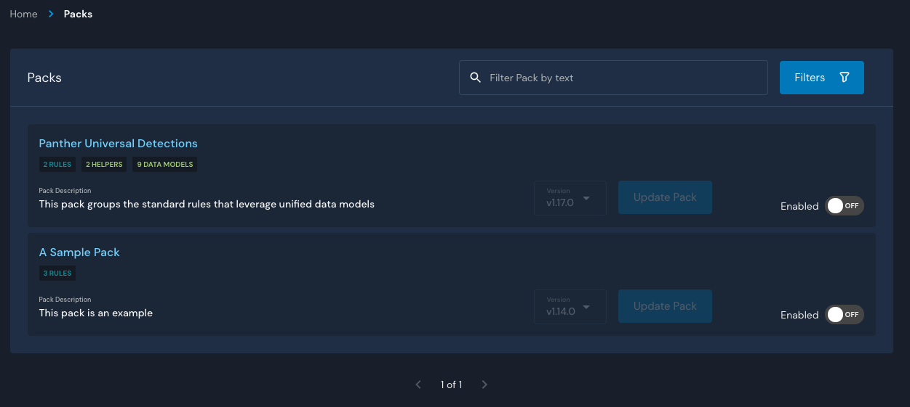
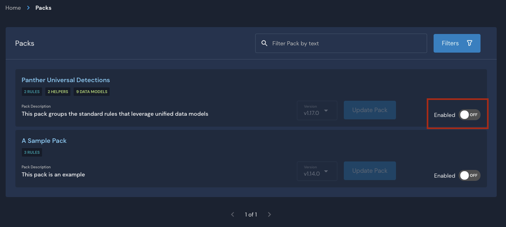
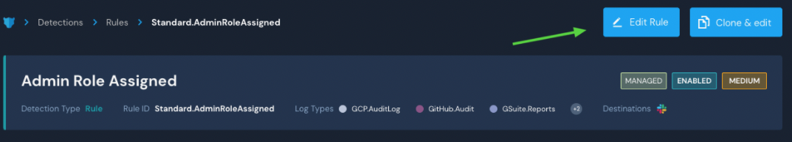
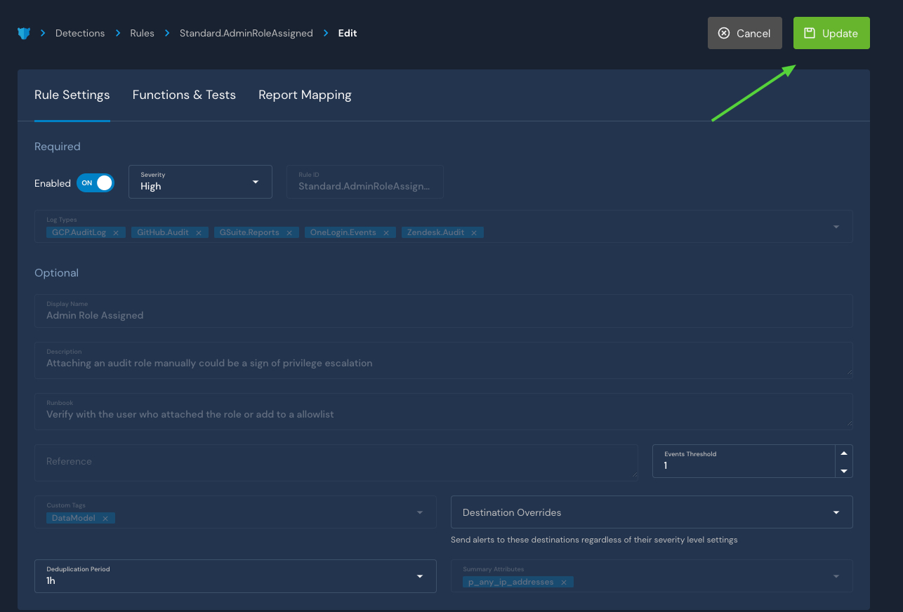
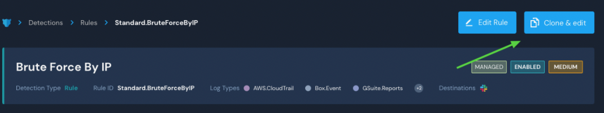

# Detection Packs

Packs are used to logically group detections as well as enable detection updates via the Panther UI. Panther-provided packs are defined in this open source repository: `panther-labs/panther-analysis`.

A single pack can group any number of detections, queries, global helpers, and data models. For example, one of the provided Detections Packs, `Panther Universal Detections`, groups all the rules that rely on data models and all of their dependencies.

Updates to detections in these packs are tracked automatically by the Panther backend. When a new update for a detection pack is available in the `panther-analysis` repository, the Packs page in your Panther Console under **Analysis > Packs** will display an _Update available_ flag next to the relevant items.

Detections that are part of an enabled detection pack will be labeled as `MANAGED`, and detections that are not part of a detection pack will be labeled as `UNMANAGED`.


Note: The process is **not** recommended if you are using a Git-Based workflow and uploading detections with Panther Analysis Tool. Doing so may result in unexpected behavior**.**&#x20;


## Panther Built-In Detection Packs

Panther provides several Detection Packs by default. There are packs that group all of the Panther-provided detections related to a particular log source, as well as Detection Packs that are grouped on a particular focus (e.g., generic rules that leverage unified data models or a core set of detections for AWS.) Some popular examples include:

| **Display Name**      | **Description**                                                                       |
| --------------------- | ------------------------------------------------------------------------------------- |
| Universal Detections  | This pack groups the standard rules that leverage unified data models                 |
| Panther Core AWS Pack | Group of the most critical and high value detections pertinent to the AWS environment |
| Panther Okta Pack     | Group of all Panther created detections for Okta                                      |

## Viewing Detection Packs

You can view a list of Panther-provided detection packs in your Panther Console under **Analysis > Packs**.



Click on a Pack to view its details, including a description, the enabled status, the currently enabled version, and which detections are in the pack.&#x20;


## Enable and Disable Detection Pack

Packs can be disabled or enabled in your Panther Console. If you enable a pack, all the detections in the pack will be enabled. If you would like to disable a single or multiple detections within it, you can do this on a one-by-one basis without having to disable the entire pack. When you update a pack that has disabled detections, the detections will be updated but they will stay disabled.

To enable or disable a Pack:

1. Log in to your Panther Console.
2. Navigate to **Analysis > Packs**.
3. Toggle the **Enabled** slider on or off.



The **Enabled** slider also appears on Pack detail pages:


## Update or Rollback Detection Pack

New updates to detection packs are periodically released to the `panther-analysis` repository. These updates are automatically detected by Panther, and the pack overview page will show an _Update Available_ flag next to relevant packs.

To update pack detections:

1. Log in to your Panther Console.
2. Navigate to **Analysis > Packs**.
3. Select the version in the "Version" dropdown menu then click **Update Pack**.


To revert to a previous Pack version:

1. Log in to your Panther Console.
2. Navigate to **Analysis > Packs**.
3. Select the version in the "Version" dropdown menu then click **Revert Pack**.


## Managing Detections with Packs

#### Editing Managed Detections

After a pack has been enabled, there are a subset of fields that you can edit:

* Enabled / Disabled
* Severity
* Events Threshold
* Deduplication Period
* Destination Override&#x20;
* Report Mappings

Any changes you make to these fields will be preserved when the pack is updated or reverted to a previous version. All other fields will be greyed out in the UI, and the "Functions and Tests" editor will be read-only. &#x20;


You can make changes to the editable fields in the Panther Console:

1. Log in to your Panther Console.
2. Navigate to **Analysis > Packs**.
3. Click on the Pack that contains the detection you want to edit, then click on the detection.
4. In the page that opens, click **Edit Rule** in the upper right side.\
   
   * You will be presented with all the fields that you can edit.
   * Note that the Report Mapping fields are located on the tab labeled Report Mapping.
5. Click **Update** to save your changes.&#x20;



#### Cloning and editing a managed detection

If a rule or policy included in a Detection Pack does not fit your needs, you can clone it and then customize the cloned copy of the Detection Pack:

1. Log in to your Panther Console.
2. Navigate to **Analysis > Packs**.
3. Click on the Pack that contains the detection you want to edit, then click on the detection.
4. In the page that opens, click **Clone & edit** in the upper right:\
   
   * You will be redirected to the standard rule creation interface where you can make changes to the new copy of the rule.
5. Click **Update** in the upper right.

Note that the display name of a cloned Detection will have `_COPY` appended to it.

Also note that cloning and editing a rule does not disable it. If you wish to have your customized copy of the Detection _replace_ the Panther managed rule, make sure to go back and [disable it](https://docs.runpanther.io/writing-detections/detection-packs#enable-and-disable-detection-pack).

The Cloned rule will not be managed by Panther or receive automatic updates when the original version of the Pack is updated. The original version that is still contained within the Pack will continue to receive updates as normal, whether it is enabled or disabled.

## Pack Sources

Pack Sources provide a way to configure custom Github sources for Detection Packs. Once a Pack Source is configured, Panther will check for new releases every day with an asset named `panther-analysis-all.zip`. The `panther_analysis_tool` (PAT) can be used to generate the required release assets as well as publish a draft release (see [Creating a Github Release - Panther Analysis Tool](detection-packs.md#creating-a-github-release-panther-analysis-tool) for additional details.) You can manage custom packs using the same functionality as Panther-provided packs.

Pack source fields are described in the following table.

| **Field Name** | **Required** | Description                                                      | Expected Value |
| -------------- | ------------ | ---------------------------------------------------------------- | -------------- |
| `Owner`        | Yes          | The owner/organization of the target repository                  | String         |
| `Repository`   | Yes          | The name of the repository                                       | String         |
| `kmsKey`       | No           | The ARN for a sign/verify kms key to validate release signatures | String         |
| `AccessToken`  | No           | Personal Access Token used to access a private repository        | String         |

### Accessing Private Repositories

In order for Panther to have access to poll a private repository, you must configure the Pack Source with a personal access token. See the [Github documentation](https://docs.github.com/en/github/authenticating-to-github/creating-a-personal-access-token) for further details on creating a token.

A personal access token will grant access to all the repositories where the account owner has access. We recommend creating a ["machine user"](https://docs.github.com/en/developers/overview/managing-deploy-keys#machine-users) that you can add as an outside collaborator to the repository containing the detection packs. This way, the access token can be scoped for a particular use and repository.

### Release Signatures

The Panther-provided packs are signed using an asymmetric AWS KMS key. Prior to importing any detections from the Panther pack source, it will validate the signature using the release asset `panther-analysis.sig`. This ensures that any detections being imported have not been tampered or modified. If you would like to use similar functionality, [create a sign/verify KMS key](https://docs.aws.amazon.com/kms/latest/developerguide/create-keys.html) and modify the policy to allow Panther to run `kms:Verify` using that key.


In this example entry to add to the key policy, the account ID should be replaced with the account ID where Panther is running:

```javascript
{
    "Sid": "Enable KMS Verify",
    "Effect": "Allow",
    "Principal": {
        "AWS": "arn:aws:iam::{accountid}:root"
    },
    "Action": "kms:Verify",
    "Resource": "*"
}
```

### Managing Pack Sources

To Add a pack source:

1. Log in to your Panther Console.
2. Navigate to **Analysis > Packs**, then click the Detection Pack Sources tab.
3. Click **Create New** in the upper right.&#x20;
   * Enter the field names for each input field.
4. Click **Save**.


To modify the `kmsKey` or `AccessToken` fields for a pack source:

1. Log in to your Panther Console.
2. Navigate to **Analysis > Packs**, then click the Detection Pack Sources tab.
3. Click `...` next to a Pack Source then click **Edit**. Click on a Pack Source.&#x20;
   * Edit the fields on this page.
4. Click **Save**.


To Delete a pack source:

1. Log in to your Panther Console.
2. Navigate to **Analysis > Packs**, then click the Detection Pack Sources tab.
3. Click `...` next to a Pack Source then click **Delete**.



Deleting a Pack Source will delete the packs originating from it, along with all of the detections in it.


### Creating a Github Release - Panther Analysis Tool

The `panther_analysis_tool` can streamline the process of creating an appropriate Github release, with or without an associated signature file.

To generate the release assets, use the `release` command.

```bash
% panther_analysis_tool release --help
usage: panther_analysis_tool release [-h] [--aws-profile AWS_PROFILE]
                                     [--filter KEY=VALUE [KEY=VALUE ...]]
                                     [--kms-key KMS_KEY]
                                     [--minimum-tests MINIMUM_TESTS]
                                     [--out OUT] [--path PATH] [--skip-tests]

optional arguments:
  -h, --help            show this help message and exit
  --aws-profile AWS_PROFILE
                        The AWS profile to use when updating the AWS Panther
                        deployment.
  --filter KEY=VALUE [KEY=VALUE ...]
  --kms-key KMS_KEY     The key id to use to sign the release asset.
  --minimum-tests MINIMUM_TESTS
                        The minimum number of tests in order for a detection
                        to be considered passing. If a number greater than 1
                        is specified, at least one True and one False test is
                        required.
  --out OUT             The path to store output files.
  --path PATH           The relative path to Panther policies and rules.
  --skip-tests
```

To automatically create a draft release in your Github repository, first set the `GITHUB_TOKEN` environment variable to a personal access token with appropriate permissions to access the target repository. Then, use the `publish` command.

```bash
% panther_analysis_tool publish --help
usage: panther_analysis_tool publish [-h] [--body BODY]
                                     [--github-branch GITHUB_BRANCH]
                                     [--github-owner GITHUB_OWNER]
                                     [--github-repository GITHUB_REPOSITORY]
                                     --github-tag GITHUB_TAG
                                     [--aws-profile AWS_PROFILE]
                                     [--filter KEY=VALUE [KEY=VALUE ...]]
                                     [--kms-key KMS_KEY]
                                     [--minimum-tests MINIMUM_TESTS]
                                     [--out OUT] [--skip-tests]

optional arguments:
  -h, --help            show this help message and exit
  --body BODY           The text body for the release
  --github-branch GITHUB_BRANCH
                        The branch to base the release on
  --github-owner GITHUB_OWNER
                        The github owner of the repsitory
  --github-repository GITHUB_REPOSITORY
                        The github repsitory name
  --github-tag GITHUB_TAG
                        The tag name for this release
  --aws-profile AWS_PROFILE
                        The AWS profile to use when updating the AWS Panther
                        deployment.
  --filter KEY=VALUE [KEY=VALUE ...]
  --kms-key KMS_KEY     The key id to use to sign the release asset.
  --minimum-tests MINIMUM_TESTS
                        The minimum number of tests in order for a detection
                        to be considered passing. If a number greater than 1
                        is specified, at least one True and one False test is
                        required.
  --out OUT             The path to store output files.
  --skip-tests
```


The `kms-key` argument is an optional argument that you can use to generate a signature file. If you want to use this argument, be sure to run panther\_analysis\_tool using the appropriate aws credentials to call `kms:Sign` on the specified key.

