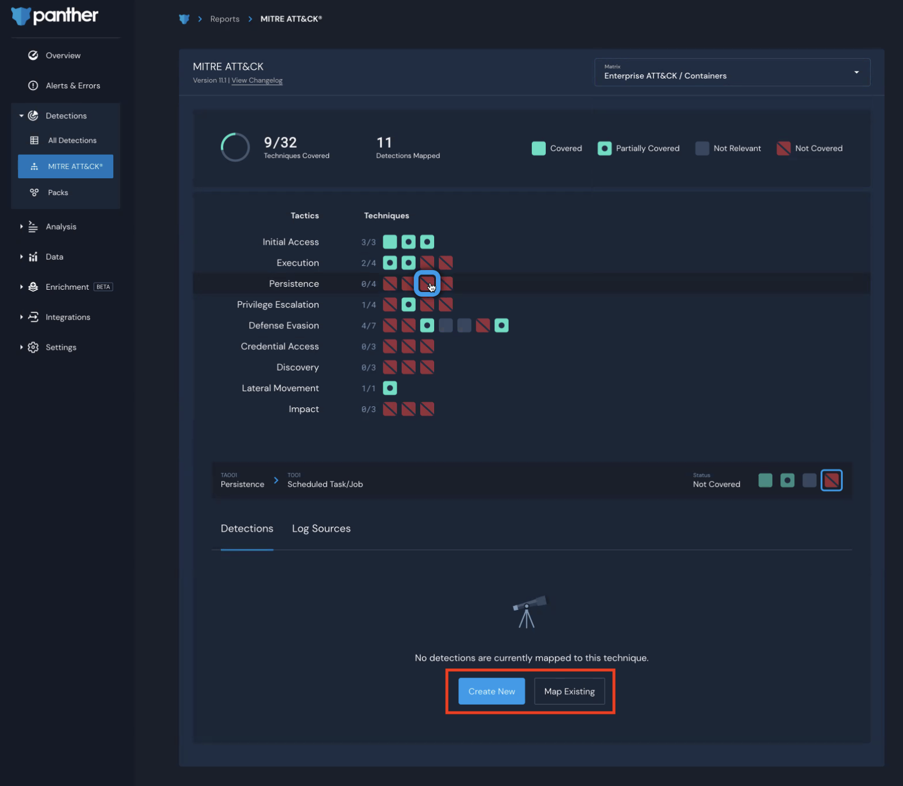

# MITRE ATT\&CK® Matrix

## Overview

Panther supports the ability to map rules, policies, and scheduled rules to frameworks to track coverage against [MITRE ATT\&CK](https://attack.mitre.org/)®. The purpose is to help you visualize coverage, identify gaps, and report progress internally for your Detections using Panther.

## How to use the MITRE ATT\&CK feature in Panther

1. Log in to your Panther Console.
2. In the left sidebar menu, click **Detections > MITRE ATT\&CK**®.
3. Choose an option from the Matrix drop-down menu in the upper right corner of the page.

Here you will see the number of techniques covered out of the total and the number of active analytics. Each Tactic is represented as a row, and a square represents each technique.


When clicking into a Technique, you will see the Detections or Log Sources that are applicable. Please note the following:

* Panther Managed Detections are automatically assigned to applicable Tactic and Technique combos as long as you are using the latest version.
* CrowdStrike as a Log Source is automatically assigned to applicable Tactic and Technique combos.
* You are able to assign enabled or disabled Detections that have log sources that you have not yet onboarded.&#x20;

You will need to assign all of your unmanaged rules, policies, and scheduled rules to the respective Tactics & Techniques. ****&#x20;

****

### Tactic and Technique possible states

* **Covered**: Confirmed by you as a covered Tactic and Technique combo
* **Partially Covered**:&#x20;
  * One or more mapped Panther managed detection or unmanaged detection
  * Onboarded Crowdstrike as a log source
* **Not Relevant**: Manually assigned to not be relevant for your environment
* **Not Covered**: No applicable detection or manually assigned

### **Adding and Editing ATT\&CK mappings in the Panther Console**

There are two ways to assign rules, policies, and scheduled rules to a Tactic and Technique: From the MITRE ATT\&CK Matrix or from the Detection create/edit workflow.

#### **From the MITRE ATT\&CK**® **Matrix:**

1. Select a Tactic and Technique that you would like to map Detections to
2. In the component under the Matrix you’ll see a list of already mapped Detections or an empty state.
3. Click **Create New** or **Map Existing** to assign Detections.\
   ****
4. For new and existing Detections the `TacticID:TechniqueID` will be automatically assigned after this step.

**From the create or edit Detection workflow:**

1. Click into a Detection.
2. Click **Edit** in the upper right.
3. Navigate to the **Report Mapping** tab
   * To add a mapping, click **Add Report**. Configure the fields:
     * **Report Key**: Enter `MITRE ATT&CK`.&#x20;
     * **Report Values**: Enter the TacticID:TechniqueID value.
   * To remove a mapping, click the trash icon next to the `TacticID:TechniqueID`
4. Click **Update**.\
   .png>)

****

### **Using tags to enrich the mapping convention**

The **Tags** field can be used to enrich the detection with more metadata about the Tactic and Technique as you see fit. For example, it may be useful to add the Tactic and Technique as a tag:

1. Click into a Detection.
2. Click **Edit** in the upper right.
3. Navigate to the **Rule Settings** tab.
4. Type the tag in the **Custom Tags** field, then press enter.
5. Click **Update** to save.\
   .png>)

### **Adding and Editing ATT\&CK mappings via PAT**

You can add ATT\&CK mappings using the Detection metadata yaml files in source code via [Panther Analysis Tool (PAT)](panther-analysis-tool.md#using-the-panther-analysis-tool). For a given Detection, add MITRE ATT\&CK key and Tactic and Technique IDs under the Reports yml tag:

```yaml
Reports:
  MITRE ATT&CK:
    - TA0006:T1110
```

Once the detection has been [uploaded via Panther Analysis Tool](panther-analysis-tool.md#uploading-to-panther) or bulk upload, the changes will be reflected in the Matrix found in the Console.

### **Identifying the Tactic and Technique ID**

You can find the TacticID and TechniqueID in the Panther Console or by visiting the [MITRE ATT\&CK website](https://attack.mitre.org/tactics/enterprise/).\
.png>)
