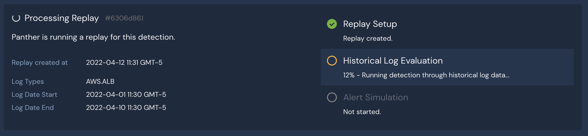
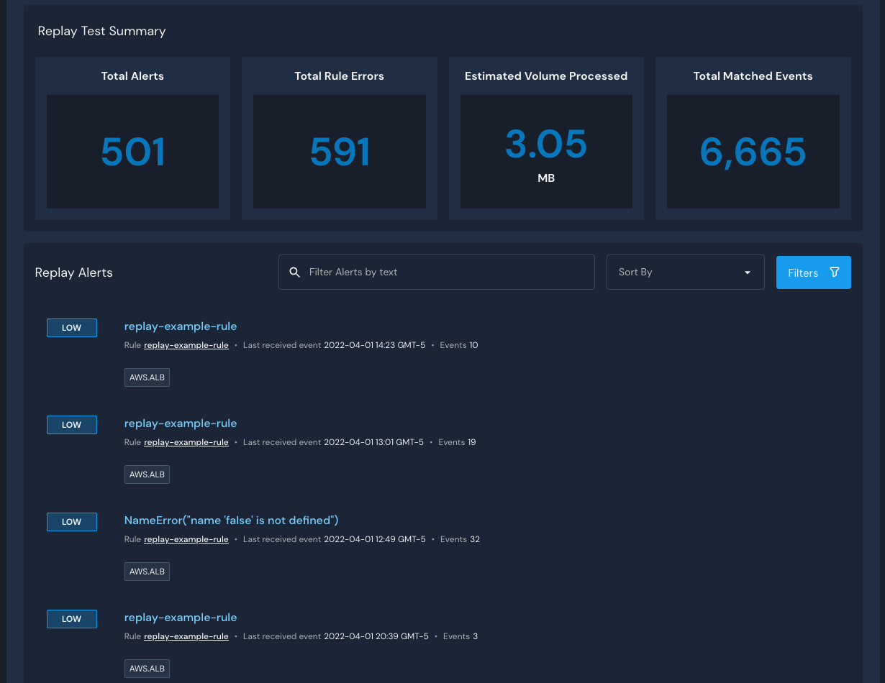
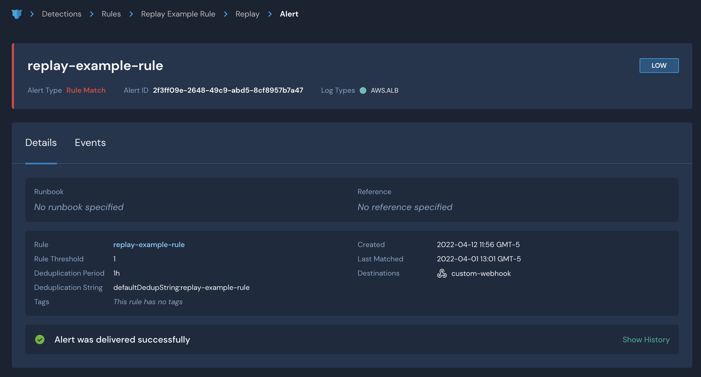

# Data Replay (BETA)


Data Replay is currently in beta. This means:&#x20;

* We would greatly appreciate feedback such as bug reports and feature requests.
* The feature will gain new functionality in future versions of Panther.&#x20;
* The UI is likely to significantly evolve over time.


With Panther's Data Replay, rules can be tested against historical log data to preview the outcome of a rule before enabling it.&#x20;

When writing or updating a detection, use Data Replay to simulate what type of alerts you are likely to receive before deploying the detection.&#x20;

Alerts generated through a replay will not be delivered to the rule's destinations or displayed on the main **Alerts & Errors** dashboard.

## Starting a Replay

Before getting started, note the following constraints:

#### Constraints

* Time range is configurable but must be within the last 30 days.
* Time range must be older than 24 hours.
* Replay must complete in under an hour.
* Access to the panther kv table is blocked to prevent modifying production data from a replay.
* Network calls from within a rule are currently not blocked, but are not supported and will be blocked in future releases.

#### How to use Data Replay:

1. Log in to your Panther Console.
2. From the left sidebar menu, click **Detections**. Click on the Detection you want to use in a Data Replay.
3. In the upper right side of the Detection's details page, click **Edit Rule**. Click the **Functions & Tests** tab and scroll down to the **Data Replay** section.\
   .png>)
4. Under **Data Replay**, select the log types and date range you wish to replay for the Detection. Click **Run Replay**.
   * The estimated run time and data size will be displayed.
   * Note: If you have made any changes to the rule, you must save your changes before started a Replay.

As the Replay is processing, the progress will be displayed. You can exit this page at any time without cancelling the Replay.&#x20;

## Viewing Replay Results

After the Replay is complete, you will see an alert summary on the detection's page that includes total alerts, total rule errors, volume processed, and total matched events. All alerts will be shown as they would appear if the alert had been enabled during this range of time.

On this page, you can filter alerts and view the events associated with each alert.&#x20;

Click on an alert for more information. On the alert's page, click the **Details** tab to see which destinations the alerts would have been sent to if the rule was live.&#x20;

Note: No alerts are sent to their destinations while replaying data.

